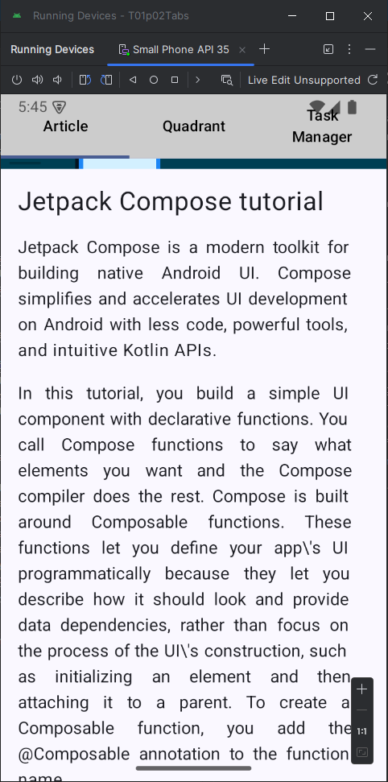

# DAM Android practices

This is a repository to upload my Android practices to the module (subject) PMDM (Programación Multimedia y Dispositivos Móviles) (Multimedia Programming and Mobile Devices) of 2nd of DAM (Desarrollo de Aplicaciones Multiplataforma) (Mutiplatform Application Development) of FP (Formación Profesional) (or Vocational Training). Studied at I.E.S. Ginés Pérez Chririnos in the 24/25 academic year.

- ## Unit 1 - Your first Android App.
    - Practice 1
        - Made from the [Android Codelab](https://developer.android.com/codelabs/basic-android-kotlin-compose-intro-kotlin-practice-problems), is a zip file with an .odf and its respective .pdf exported with all the solved exercises in Kotlin Playground.
    - Practice 2
        - Previous Practices Requirement:
            - Happy Birthday Project made from the [Android Codelab](https://developer.android.com/codelabs/basic-android-kotlin-compose-text-composables#0) renamed to [SimpleTextApp](https://github.com/xabyer/dam-android/tree/main/T01p02/PreviousPractices/SimpleTextApp)

            - Happy Birthdayy Project + Image made from the [Android Codelab](https://developer.android.com/codelabs/basic-android-kotlin-compose-add-images#0) renamed to [SimpleImageTextApp](https://github.com/xabyer/dam-android/tree/main/T01p02/PreviousPractices/SimpleImageTextApp). The most important modification I made to this practice was to add a vertical scroll to the text because it doesn't fit on small devices. The rest are minior customizations of sizes and fonts of no importance.

        - V1 - Version 1 - First version of this App very similar to the original [Android Codelab](https://developer.android.com/codelabs/basic-android-kotlin-compose-composables-practice-problems#0). I left the previews to avoid running the app to see each view because it's designed to beginners and lacks navigation. However I will fix this in future versions to make the practice more interesting. The main difference is that I structured the code on packages more similar to how it would be done in a real app, but not strictly by following the practice. I will do this in future versions. To see other views in the app it's necesary to comment and uncomment these views in the [Home](https://github.com/xabyer/dam-android/blob/main/T01p02/V1/app/src/main/java/fdez/collados/fco/javier/t01p02/views/Home.kt) view and run the application.
        
        - V2 - Version 2 - [T01P02Tabs](https://github.com/xabyer/dam-android/tree/main/T01p02/V2/T01p02Tabs) is a version with tabs navigation between views.
        \
        I added a vertical scroll to the article view because it didn't fit on small devices, but this came from the previous version and I only keep it in this one.  I have restructured the package without Home view since the TabsView acts as Home view. I have made the decision to separate componentes (in their package) from views and call the views as such, i.e. ArticleView, QuadrantView, etc. This way it is clearer at a glance that they are reusable components and that they are views that are going to be displayed as screens of the app.

    - Pratice 3
        -V1 - Version 1 - First version made from the [Android Codelab](https://developer.android.com/codelabs/basic-android-kotlin-compose-business-card) Business Card. This version has only the GUI with Jetpack Compose as the practice required. I have certain **intent**ions for future versions.  😊

- ## Unit 2 - Build App UI

    - Practice 1
        - Made from the [Android Codelab](https://developer.android.com/codelabs/basic-android-kotlin-compose-kotlin-fundamentals-practice-problems). This time I prefer to do it with IntelliJ, because the important thing is the code of the exercises. It is also a kotlin-centric practice, so it was easier to use IntelliJ than creating a whole project with Android Studio. This way I also save myself the time to making the pdf document using Kotlin Playground.

    - Practice 2
        - Made from the [Android Codelab](https://developer.android.com/codelabs/basic-android-kotlin-compose-button-click-practice-problem) lemonade practice. I've only chaged colors because I did not like the colors used in practice.
